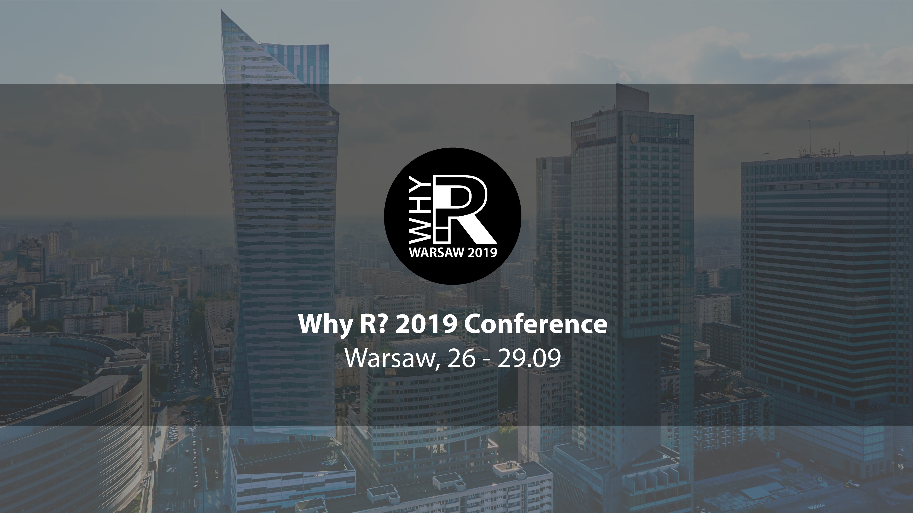
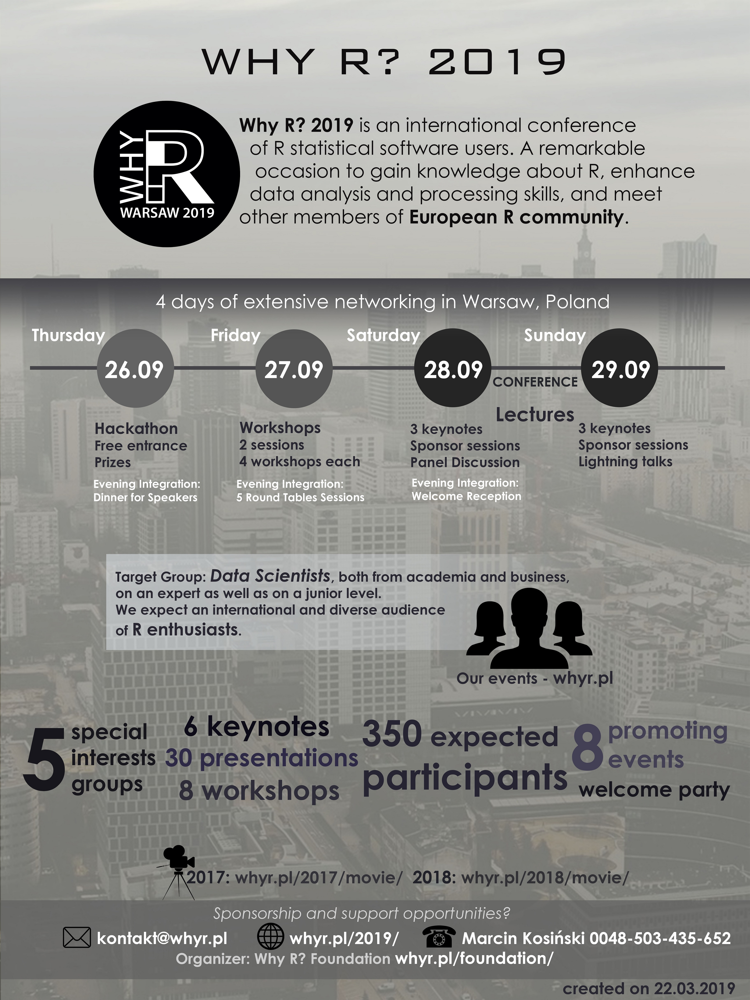
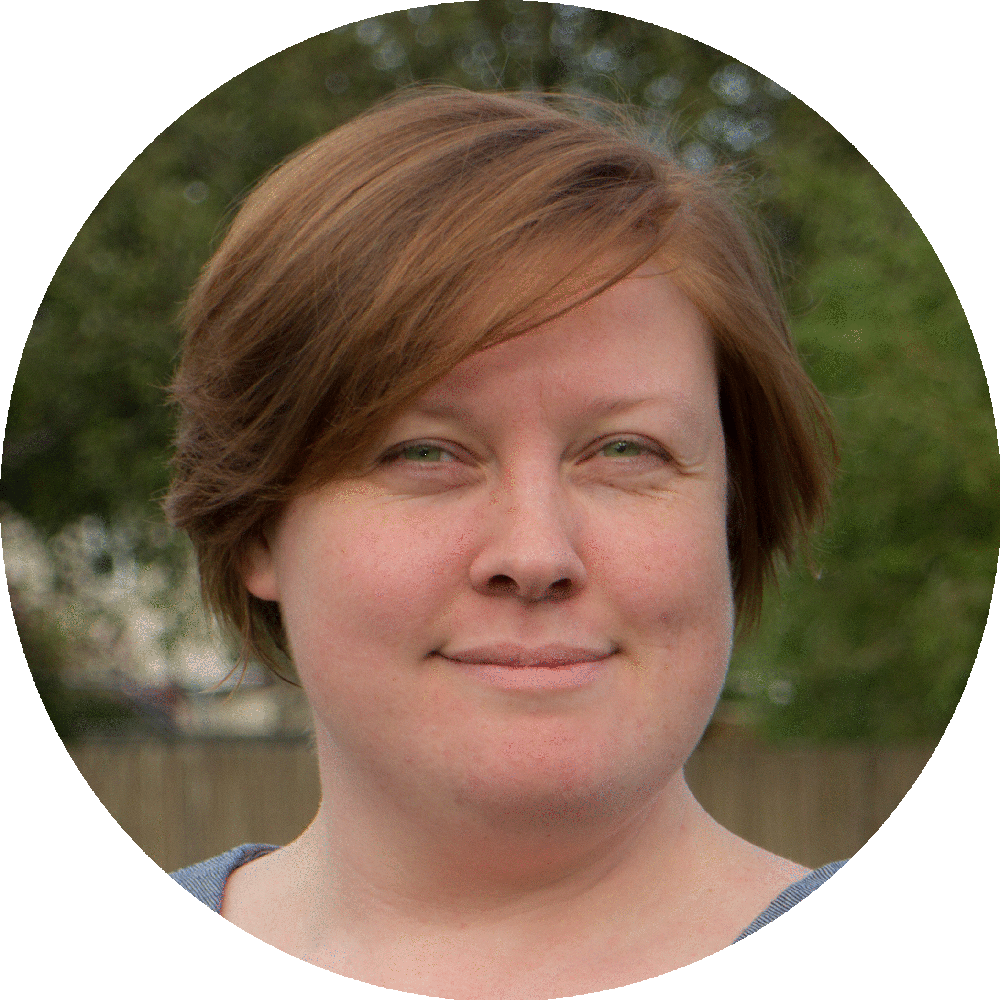
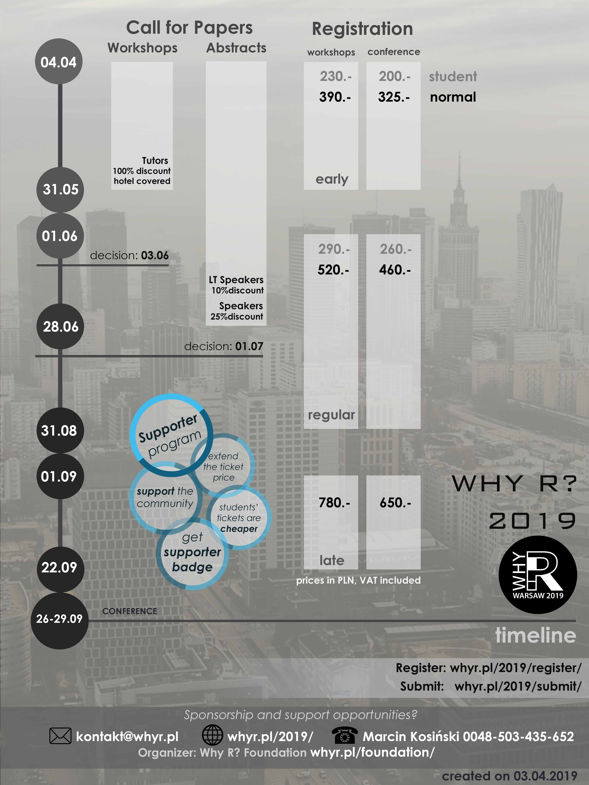
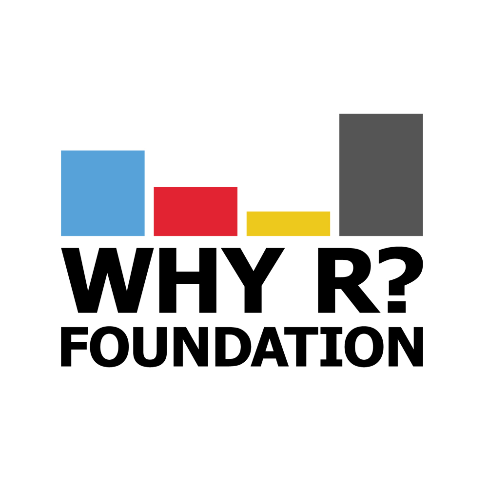
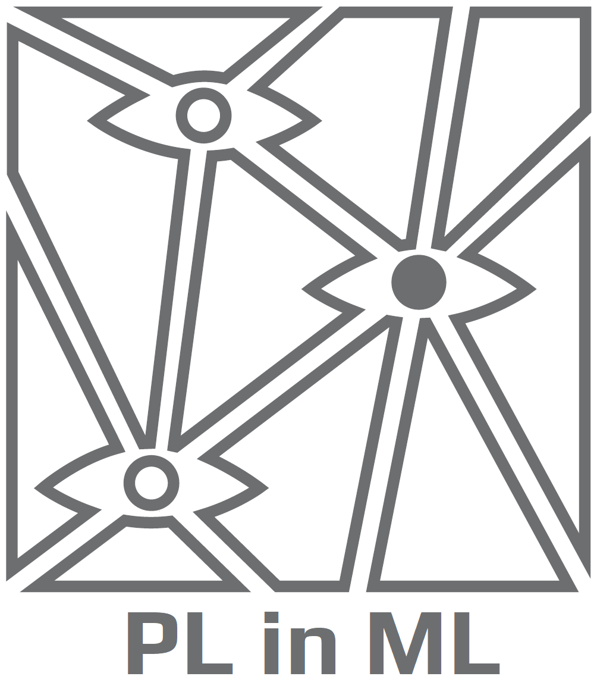
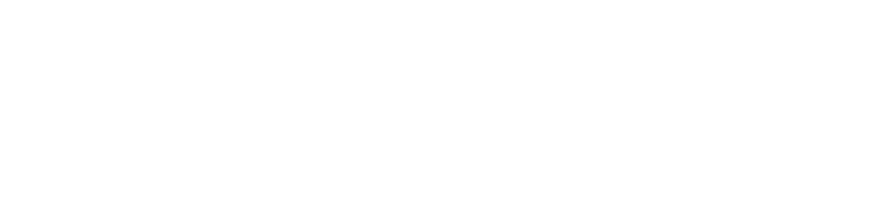

```{r setup, include=FALSE}
htmltools::tagList(rmarkdown::html_dependency_font_awesome())
knitr::opts_chunk$set(echo = TRUE)
```


<center>





# Conference Details




# Invited Speakers


```{r, echo=FALSE, results='asis', warning=FALSE, message=FALSE}
knitr::kable(row.names = FALSE, align = 'c',
                         
            t(
                data.frame(
                grafika = c('{ width=300px }', '{ width=300px }'),
                kto = c('Jakub Nowosad', 'Steph Locke'),
                afiliacja = c('Institute of Geoecology and Geoinformation', 'Principal Consultant (GBR)'),
                afiliacja2 = c('Adam Mickiewicz University', 'Locke Data')
                
              )
            )
)
```


# Registration and Call for Papers

[[Register]](http://whyr.pl/2019/register/)
[[Submit Talk]](http://whyr.pl/2019/submit/) 



# Organizers

{ width=45% } { width=38.5% }

[[Why R? Foundation]](http://whyr.pl/)
[[PLinML Society]](http://plinml.mimuw.edu.pl/) 

# Sponsors

## Bronze

{ width=45% } 

# Pre Meetings


# Social Media

<a href='http://twitter.com/whyRconf'><i class='fa fa-twitter'></i></a>&nbsp;&nbsp;<a href='http://facebook.com/whyRconf/'><i class='fa fa-facebook'></i></a>&nbsp;&nbsp;<a href='https://github.com/WhyRFoundation'><i class='fa fa-github'></i></a>&nbsp;&nbsp;<br>

# Previous Editions


[[2017 After Movie]](https://vimeo.com/239259242) &nbsp;&nbsp; [[2017 Photos]](https://www.facebook.com/whyRconf/photos/) &nbsp;&nbsp; [[2017 Presentations]](https://github.com/WhyR2017/prezentacje)

[[2018 After Movie]](https://www.youtube.com/watch?v=NNsceaqEP1w) &nbsp;&nbsp; [[2018 Photos]](https://www.facebook.com/whyRconf/photos/) &nbsp;&nbsp; [[2018 Presentations]](https://github.com/WhyR2018/presentations)

```{r,echo=FALSE}
# <iframe src="https://player.vimeo.com/video/239259242?title=0&byline=0&portrait=0" width="640" height="360" frameborder="0" allow="autoplay; fullscreen" allowfullscreen></iframe>
# <p><a href="https://vimeo.com/239259242">Why R? 2017</a></p>

```

# Code of Conduct

<div class="coc">
Source: our code of conduct was adapted from the <a href="https://user2017.brussels/code-of-conduct/">useR! 2017 code of conduct</a>.


All attendees, speakers, sponsors and volunteers at Why R? 2019 are required to agree to the following code of conduct. Organizers will enforce this code throughout and expect cooperation in ensuring a safe environment for all.

Harassment includes offensive verbal comments related to gender, sexual orientation, disability, physical appearance, body size, race, religion, sexual and or discriminatory images in public spaces, deliberate intimidation, stalking, following, harassing photography or recording, sustained disruption of talks or other events, inappropriate physical contact, and unwelcome sexual attention.

Participants asked to stop any harassing behavior are expected to comply immediately.

Sponsors are also subject to the anti-harassment policy. In particular, sponsors should not use sexualized images, activities, or other material. Staff epresenting sponsors should not use sexualized clothing/uniforms/costumes, or otherwise create a sexualized environment.

Participants engaging in harassing behavior may be sanctioned in any way organizers deem appropriate, including expulsion from the conference without refund and providing details to partner institutions and events.

If you are being harassed, notice that someone else is being harassed, or have any other concerns, please contact a member of Why R? 2019 staff immediately. Why R? 2019 staff can be readily identified as they will be wearing distinctive Why R? 2019 arm bands.

Why R? 2019 staff will be happy to help participants contact hotel/venue security or local law enforcement, provide escorts, or otherwise assist those experiencing harassment to feel safe for the duration of Why R? 2019. We value your attendance.
</div>
</center>